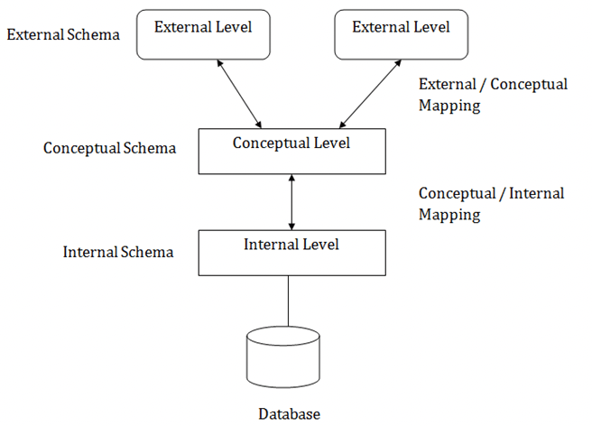

 Q) What is Data?
 > Data is a collection of raw, unorganized facts and details like text, observations, figures, symbols,
descriptions of things, etc.

Q) Types of Data
> a. Quantitative
> > Numerical form
> b. Qualitative
> >  Descriptive, but not numerical.

Q) What is Information?
> a. Info. Is processed, organized, and structured data.

Q) Data vs Information
> Data is a raw and unorganized collection of facts, while information organized it puts those facts into context.  
> Data does not depend on the information, however, information depends on data.  
> Data isn't sufficient for decision-making but we can make decisions based on information.     

Q) What is database?
> Database is an electronic place/system where data is stored in a way that it can be easily accessed, managed, and update.   
> we need Database management system.(DBMS) to make updates in db   

Q) What is DBMS
> (DBMS) is a collection of interrelated data and a set of programs to access those data. The collection of data, usually referred to as the database, contains information relevant to an enterprise. The primary goal of a DBMS is to provide a way to store and retrieve database information that is both convenient and efficient.   
> **A DBMS is the database itself, along with all the software and functionality.** It is used to perform different operations, like addition, access, updating, and deletion of the data.   

> * The major purpose of DBMS is to provide users with an abstract view of the data   

 

### DBMS vs File Systems
> a. File-processing systems have major disadvantages.  
>> i. Data Redundancy and inconsistency  
>> ii. Difficulty in accessing data  
>> iii. Data isolation  
>> iv. Integrity problems  
>> v. Atomicity problems  
>> vi. Concurrent-access anomalies  
>> vii. Security problems   
> b. The above 7 are also the Advantages of DBMS (answer to “Why to use DBMS?”)  
 

//////////////////////////////////////////////////////////////////////////////////////////////////////////////////////////////////////

 
 
 

# View of Data (Three Schema Architecture)

> The major purpose of DBMS is to provide users with an abstract view of the data. That is, the system hides certain details of how the data is stored and maintained.

> To simplify user interaction with the system, abstraction is applied through several levels of abstraction.

> The main objective of three level architecture is to enable multiple users to access the same data with a personalized view while storing the underlying data only once

### Physical level / Internal level

* The lowest level of abstraction describes how the data are stored.
* Talks about: Storage allocation (N-ary tree etc), Data compression & encryption etc.
* Low-level data structures used. <a href="">learn more </a>

### Logical level / Conceptual level:

* The conceptual schema describes the design of a database at the conceptual level, describes what data are stored in DB, and what relationships exist among those data
* DBA, who must decide what information to keep in the DB use the logical level of abstraction.

### View level / External level
* Highest level of abstraction aims to simplify users’ interaction with the system by providing different view to different end-user.
* Each view schema describes the database part that a particular user group is interested and hides the remaining database from that user group
* At the external level, a database contains several schemas that sometimes called as subschema. The subschema is used to describe the different view of the database.

 

# DBMS Application Architectures

> architecture which defines how the client system will interact with DB  
> Client machines, on which remote DB users work, and server machines on which DB system runs.  

### T1 Architecture
> The client, server & DB all present on the same machine.  
> Ex: project in which database is present in our local system  

### T2 Architecture
> App is partitioned into 2-components   
> Client machine, which invokes DB system functionality at server end through query language statements.  
> API standards like ODBC & JDBC are used to interact between client and server  

### T3 Architecture
> App is partitioned into 3 logical components   
> Client machine is just a frontend and doesn’t contain any direct DB calls.   
> Client machine communicates with App server, and App server communicated with DB system to access data.
> T3 architecture are best for WWW Applications
> 

